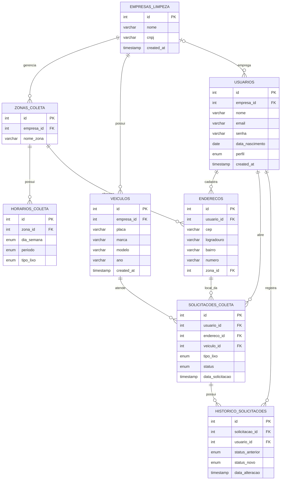

# Garixos - Sistema de Gestão de Zeladoria e Coleta de Resíduos

Este projeto é uma plataforma fullstack desenvolvida como projeto acadêmico para gerenciar a logística de coleta de resíduos, conectando cidadãos a empresas de limpeza urbana. Inicialmente concebido como um protótipo visual, o sistema agora conta com uma camada robusta de dados em Node.js e banco de dados relacional.

## 👥 Equipe do Projeto
- **Product Owner (PO):** Thiago Oliveira
- **Scrum Master:** Accioli
- **Front-end:** Natã e Stefany
- **Back-end:** João e Diego
- **Banco de Dados:** Caue e Edu

---

## 🖥️ Camada Front-end (Interface)
A interface foi estruturada para ser simples e intuitiva para o usuário final:
- `index.html`: Página para fazer login com CPF e senha.
- `criarcadastro.html`: Página para criar uma conta nova.
- `principal.html`: Página principal com informações e opções de coleta.
- `css/`, `js/` e `assets/`: Arquivos de estilização, scripts visuais e imagens.

> **Nota de Evolução:** Nas versões iniciais, os dados eram guardados apenas no `localStorage` do navegador e funções como mapa e login social eram apenas visuais. A versão atual integra o sistema a um banco de dados real, garantindo segurança e persistência das informações.

---

## ⚙️ Camada Back-end e Banco de Dados
O backend é construído em Node.js com a ORM Sequelize para gerenciar toda a operação do sistema de coleta. A arquitetura suporta perfis de acesso, dividindo as jornadas entre o Portal do Cidadão e o Painel Administrativo Interno.

O assistente virtual agora é servido pelo back-end em `/api/assistant/chat`. A chave do Gemini não fica mais no front-end; ela deve ser configurada no arquivo `.env` com a variável `GEMINI_API_KEY`.

### Estrutura de Diretórios
- `package.json`: Dependências do Node e scripts.
- `server.js`: Ponto de entrada da API RESTful com Express.
- `config/config.json`: Configuração de conexão com o banco de dados.
- `models/`: Definições das entidades Sequelize e arquivo de inicialização (`index.js`).
- `repositories/`: Camada de abstração para as operações no banco de dados.
- `migrations/`: Arquivos de migração para criar as tabelas no banco de dados.
- `seeders/`: Diretórios para carregamento de dados fictícios ou iniciais.

### Modelos Principais
- `EmpresaLimpeza` (`models/empresalimpeza.js`)
- `ZonaColeta` (`models/zonacoleta.js`)
- `Veiculo` (`models/veiculo.js`)
- `Usuario` (`models/usuario.js`)
- `HorarioColeta` (`models/horariocoleta.js`)
- `Endereco` (`models/endereco.js`)
- `SolicitacaoColeta` (`models/solicitacaocoleta.js`)
- `HistoricoSolicitacao` (`models/historicosolicitacao.js`)

---

## 🚀 Atualizações Recentes (Maio 2026)

O back-end do Garixos passou por uma grande evolução estrutural, consolidando o núcleo relacional do sistema. A API agora suporta o ciclo de vida completo (CRUD) para as principais entidades da logística de coleta, com validações de integridade no PostgreSQL.

### ✨ Novas Funcionalidades Implementadas:
* **Gestão de Usuários e Empresas:** Finalização das rotas de atualização (`PUT`) e exclusão (`DELETE`), com proteção e regras de negócio.
* **Mapeamento de Endereços:** CRUD completo da entidade `Endereços`, garantindo que os usuários possam registrar os locais exatos para as coletas.
* **Zonamento Logístico:** Implementação da entidade `ZonaColetas` para dividir as áreas de atuação (ex: Zona Norte, Baixada Fluminense) e resolver chaves estrangeiras com os endereços.
* **Gestão de Frota:** Cadastro e gerenciamento de `Veículos` para alocação nas operações das empresas de coleta.
* **O Coração do Sistema (Solicitações de Coleta):**
  * Criação completa do fluxo transacional cruzando Usuário, Endereço e Veículo.
  * Implementação de mudança de status logístico (ex: de `PENDENTE` para `EM_ANDAMENTO`).
  * **Consultas Avançadas (Eager Loading):** As rotas de requisição (`GET`) agora utilizam relacionamentos do Sequelize (`include`) para retornar um JSON estruturado e limpo, trazendo automaticamente os nomes dos usuários, logradouros e placas dos veículos, otimizando o consumo de dados pelo front-end e por futuros dashboards.

---

## 📊 Diagrama Entidade-Relacionamento (DER)
A arquitetura do banco de dados foi normalizada utilizando restrições de chaves estrangeiras (`FK`) e `ENUMs` para garantir a integridade do histórico operacional.



## 🚀 Instalação e Uso
1. **Clone o repositório:**
  ```bash
  git clone [https://github.com/steh-cpu/ProjetoGarixos.git](https://github.com/steh-cpu/ProjetoGarixos.git)
  cd garixos
  ```
2. **Instale as dependências:**
  ```bash
  npm install
  ```
3. **Configure as variáveis de ambiente:**
  Crie um arquivo `.env` com o conteúdo abaixo:
  ```bash
  GEMINI_API_KEY=sua_chave_do_gemini
  ```
4. **Configure o Banco de Dados:**
  Ajuste o arquivo `config/config.json` com as credenciais do seu banco PostgreSQL local.
5. **Execute as Migrações para criar as tabelas:**
  ```bash
  npx sequelize-cli db:migrate
  ```
6. **Carregue dados iniciais (Opcional):**
  ```bash
  npx sequelize-cli db:seed:all
  ```
## 📌 Observações Finais
 * O projeto usa sequelize e pg para conectar ao PostgreSQL.
 * O arquivo models/index.js contém a inicialização do Sequelize e a importação automática de todos os modelos.
 * As rotas HTTP (API REST) para as entidades principais (Usuários, Empresas, Endereços, Veículos, Zonas e Solicitações) já foram estabelecidas e testadas com Express e Postman.
 * **Licença:** ISC
```

```
